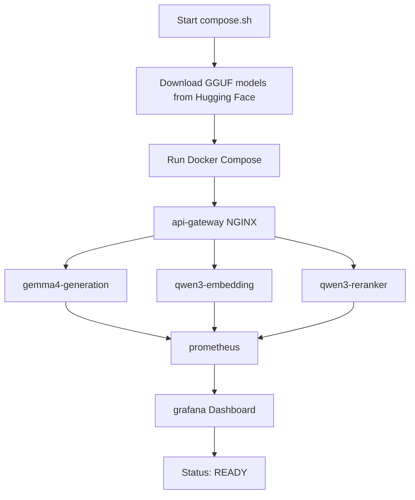

# Gemma 4 Turbo - llama.cpp Setup

This repository provides a streamlined setup for running **Gemma 4 Turbo** and supporting AI services with configured context windows using **llama.cpp** and **Docker Compose**.

## Overview



The setup leverages automation scripts to manage the lifecycle of multiple Docker containers, model downloading (via Hugging Face), and an optimized AI stack including generation, embedding, and reranking services, specifically targeting hardware with NVIDIA GPUs.

## Components

- **`compose.sh`**: The primary orchestration script that:
  - Detects GPU UUIDs for targeted hardware allocation.
  - Deploys the full stack via `docker compose`.
  - Performs health checks on the generation server to ensure the system is ready.
- **`docker-compose.yml`**: Defines the multi-container architecture, including resource limits, GPU reservations, and network mappings.
- **`api-gateway` (NGINX)**: A unified entry point that routes traffic to the appropriate AI service.
- **Observability Stack**:
  - **Prometheus**: Scrapes metrics from the llama.cpp services.
  - **Grafana**: Provides a visual dashboard for monitoring performance and hardware utilization.
- **`refresh_hf_models.sh`**: A bash script that downloads specific quantized GGUF models from Hugging Face using `hf_transfer` for high speed.
- **`.clinerules`**: Project-specific development guidelines.

## Prerequisites

- **Docker & Docker Compose**: Installed and running.
- **NVIDIA GPU**: Required for GPU acceleration (`--gpus all`).
- **Bash Environment**: A bash-compatible shell (e.g., Git Bash, WSL, or Linux/macOS terminal) to execute the scripts.
- **LLAMA_HOME**: An environment variable defining the base directory for models and cache.

## Setup and Usage

1.  **Set LLAMA_HOME**:
    Define the `LLAMA_HOME` environment variable to point to your desired storage location for models and cache.

2.  **Download Models**:
    Run the model refresh script to pull the required GGUF files:
    ```bash
    ./refresh_hf_models.sh
    ```

3.  **Run the Stack**:
    Execute the orchestration script:
    ```bash
    ./compose.sh
    ```

4.  **Accessing the Services**:
    Once the script outputs `Model ready!`, the services are available at:
    - **API Gateway**: `http://localhost:8080`
    - **Prometheus**: `http://localhost:9090`
    - **Grafana**: `http://localhost:3000` (Default login: admin/admin)

## Configuration Details

### Model Parameters
The stack is configured with the following services:

| Service | Model | GPU | Context Window | Purpose |
| :--- | :--- | :--- | :--- | :--- |
| **Gemma 4** | `gemma4-31B...` | RTX 5090 | 262,144 | Text Generation |
| **Qwen3 Embedding** | `qwen3-emb...` | RTX 4090 | 32,768 | Vector Embeddings |
| **Qwen3 Reranker** | `qwen3-rerank...` | RTX 4090 | 32,768 | Relevance Ranking |

**Common Optimizations**:
- **Flash Attention**: Enabled (`--flash-attn on`) across all services.
- **GPU Layers**: Maximum acceleration (`--n-gpu-layers 99`).
- **Memory**: Use of `--mlock` and `--no-mmap` for the generation service to optimize performance.

### Docker Runtime
The environment is managed via Docker Compose:
- **Images**: Uses `llama-cpp-turboquant:latest` for AI services.
- **Volume mounts**: Local `models` and `cache` directories (defined by `LLAMA_HOME`) are mapped to `/models` and `/cache` inside the containers.
- **Networking**: Services communicate internally, with the NGINX gateway exposing the unified port `8080`.

## Performance

Typical performance observed with the current configuration:

- **Throughput**: ~33 tokens/second (TPS) for Gemma 4.
