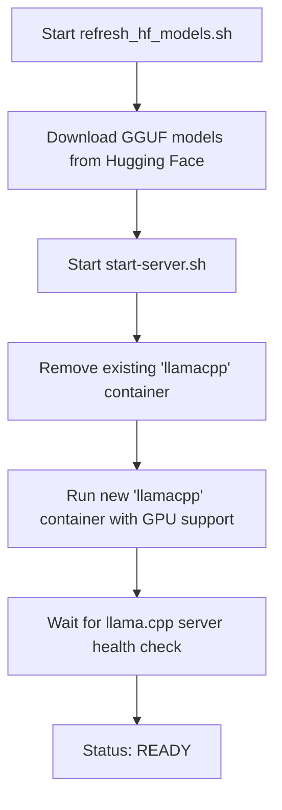

# Gemma 4 Turbo - llama.cpp Setup

This repository provides a streamlined setup for running **Gemma 4 Turbo** with a configured context window using **llama.cpp** and **Docker**.

## Overview



The setup leverages automation scripts to manage Docker container lifecycle, model downloading (via Hugging Face), and optimized llama.cpp server configuration, specifically targeting hardware with NVIDIA GPUs.

## Components

- **`start-server.sh`**: A bash script that:
  - Cleans up existing `llamacpp` containers.
  - Runs the `llama.cpp` Docker container with NVIDIA GPU support.
  - Mounts local models and cache directories into the container.
  - Configures the server for the configured context window and flash attention.
  - Performs a health check to ensure the server is ready.
- **`refresh_hf_models.sh`**: A bash script that:
  - Downloads specific quantized GGUF models from Hugging Face using `hf_transfer` for high speed.
- **`.clinerules`**: Project-specific development guidelines.

## Prerequisites

- **Docker**: Installed and running.
- **NVIDIA GPU**: Required for GPU acceleration (`--gpus all`).
- **Bash Environment**: A bash-compatible shell (e.g., Git Bash, WSL, or Linux/macOS terminal) to execute the scripts.
- **LLAMA_HOME**: An environment variable defining the base directory for models and cache.

## Setup and Usage

1.  **Set LLAMA_HOME**:
    Define the `LLAMA_HOME` environment variable to point to your desired storage location for models and cache.

2.  **Download Models**:
    Run the model refresh script to pull the required GGUF files:
    ```bash
    ./refresh_hf_models.sh
    ```

3.  **Run the Server**:
    Execute the startup script:
    ```bash
    ./start-server.sh
    ```

4.  **Accessing the Server**:
    Once the script outputs `Model ready!`, the server is available at:
    `http://localhost:8080`

    You can interact with it via the llama.cpp API.

## Configuration Details

### Model Parameters
The setup uses the following configurations (as defined in `start-server.sh`):
- **Base model**: `gemma-4-26B-A4B-it-UD-Q4_K_XL.gguf`
- **Context window**: Defined in `start-server.sh`
- **Flash Attention**: Enabled (`--flash-attn on`)
- **GPU Layers**: Maximum acceleration (`--n-gpu-layers 999`)
- **Cache Types**: `q8_0` for both K and V cache to optimize memory/performance balance.

### Docker Runtime
The container is configured with:
- **Image**: `ghcr.io/ggml-org/llama.cpp:server-cuda`
- **Port mapping**: `8080:8080`
- **Volume mounts**: Local `models` and `cache` directories mapped to `/models` and `/cache` inside the container.

## Performance

Typical performance observed with the current configuration:

- **Throughput**: ~160 tokens/second (TPS)


