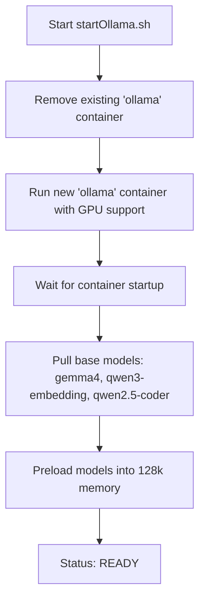

# Gemma 4 Turbo - Ollama Setup

This repository provides a streamlined setup for running **Gemma 4 Turbo** with an extended **128k context window** using **Ollama** and **Docker**.

## Overview



The setup leverages an automation script to handle Docker container lifecycle, model pulling, and model preloading for optimized performance, specifically targeting hardware with approximately 24GB of VRAM.

## Components

- **`startOllama.sh`**: A bash script that:
  - Cleans up existing Ollama containers.
  - Runs the Ollama Docker container with GPU support.
  - Mounts the current directory into the container.
  - Pulls the required base models.
  - Preloads models into memory.
- **`.dockerignore`**: Ensures efficient Docker builds by excluding unnecessary files.

## Prerequisites

- **Docker**: Installed and running.
- **NVIDIA GPU**: Required for GPU acceleration (`--gpus=all`).
- **Bash Environment**: A bash-compatible shell (e.g., Git Bash, WSL, or Linux/macOS terminal) to execute `startOllama.sh`.

## Setup and Usage

1.  **Configure Paths (Optional)**: 
    Review `startOllama.sh` to ensure the volume mounts (e.g., `/c/Workspace/data/ollama`) match your local environment.

2.  **Run the Setup Script**:
    Open your terminal and execute:
    ```bash
    ./startOllama.sh
    ```

3.  **Accessing the Model**:
    Once the script outputs `READY`, the models are available via the Ollama API or via `docker exec`:
    ```bash
    docker exec -it ollama ollama run gemma4:26b-a4b-it-q4_K_M
    ```

## Configuration Details

### Model Parameters
The setup uses the following model configuration via the script:
- Base model: `gemma4:26b-a4b-it-q4_K_M`
- Context window: `131072` (128k)

### Docker Runtime
The container is configured with:
- `OLLAMA_KEEP_ALIVE=1h`: Keeps the model in memory for 1 hour.
- `OLLAMA_NUM_PARALLEL=1`: Optimized for single-request stability.
- `OLLAMA_FLASH_ATTENTION=1`: Enabled for improved performance in long-context scenarios.
- Port mapping `11434:11434` to avoid conflicts with existing Ollama instances.
